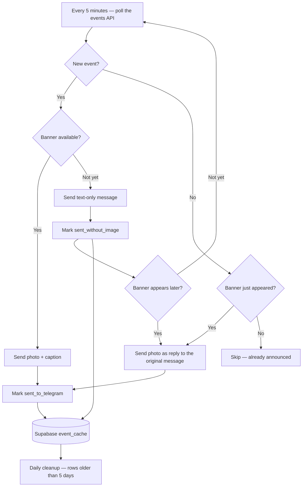
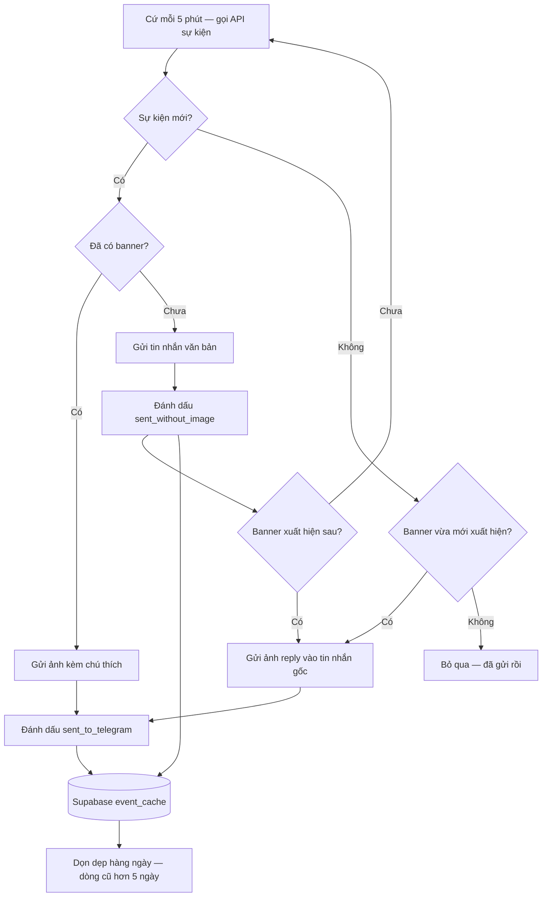

<div align="center">


# Auto Events Telegram Bot

**Automatically announces game events on your Telegram channel — banners included, never duplicated, always on time.**

`⏱ Polls every 5 minutes` · `🔁 Exactly-once delivery` · `🖼 Late banners handled gracefully`

[](https://www.python.org/)
[](https://github.com/python-telegram-bot/python-telegram-bot)
[](https://supabase.com/)
[](https://github.com/agronholm/apscheduler)
[](LICENSE)
[](https://github.com/nqzkhoi010608/BOT-AUTO-EVENTS-TELEGRAM/pulls)

**🇬🇧 [English](#-english)** · **🇻🇳 [Tiếng Việt](#-tiếng-việt)**

</div>

---

## 🇬🇧 English

### 📖 Contents

| | | |
|---|---|---|
| ✨ [Features](#-features) | 🔄 [How It Works](#-how-it-works) | 🖼 [Message Preview](#-message-preview) |
| 🧱 [Tech Stack](#-tech-stack) | 📁 [Project Structure](#-project-structure) | 🚀 [Quick Start](#-quick-start) |
| 🔧 [Configuration](#-configuration) | 🌍 [Deployment](#-deployment) | 🧾 [Logging](#-logging) |
| 🔒 [Security Notes](#-security-notes) | 🤝 [Contributing](#-contributing) | 📄 [License](#-license) |

### ✨ Features

| Feature | Details |
|---|---|
| ⏱ **Automatic polling** | Checks the events API every 5 minutes (configurable) |
| 🔁 **Exactly-once delivery** | Supabase-backed deduplication that survives restarts |
| 🖼 **Smart banner handling** | Announces text first, then posts the image as a **reply** once it appears |
| 🔗 **Validated links** | Only real, healthy URLs become "Access Now" buttons |
| 🕐 **Localized times** | All timestamps rendered in Vietnam time (UTC+7) |
| 🧹 **Self-cleaning cache** | Rows older than 5 days are purged automatically |
| 🛡️ **Graceful errors** | API failures are logged — your channel never receives error spam |
| 📝 **Dual logging** | Console **and** `bot.log` file, UTF-8 safe on Windows |
| 🎨 **Rich formatting** | Clean HTML layout for every announcement |

### 🔄 How It Works



Every event gets a stable identity (`name + startTime`), so restarts and re-polls can never cause duplicate announcements.

### 🖼 Message Preview

What your channel receives (with the banner image attached when available):

```text
┌────────────────────────────────────┐
│                                    │
│        [ EVENT BANNER IMAGE ]      │
│                                    │
│  Title:   FIREWORK FESTIVAL        │
│  Region:  GLOBAL                   │
│  Start:   01/10/2026 00:00:00      │
│  End:     08/10/2026 23:59:59      │
│  Link:    Access Now               │
│                                    │
└────────────────────────────────────┘
```

> [!NOTE]
> The `Link` row only appears when the event's URL is a valid link (not a numeric ID) **and** responds with a healthy HTTP status. The bot even double-checks with a `HEAD` request before showing it.

### 🧱 Tech Stack

| Layer | Technology | Version |
|---|---|---|
| Runtime | Python | 3.10+ |
| Telegram delivery | python-telegram-bot | 21.0.1 |
| Database | Supabase (PostgreSQL) via supabase-py | 2.10.0 |
| Scheduling | APScheduler (async) | 3.10.4 |
| HTTP | requests | 2.31.0 |
| Timezone | pytz — Asia/Ho_Chi_Minh | 2024.1 |
| Configuration | python-dotenv | 1.0.1 |

### 📁 Project Structure

<details>
<summary><b>Click to expand</b></summary>

```text
BOT-AUTO-EVENTS-TELEGRAM/
├── app.py                 # Entry point — initializes components, keeps the process alive
├── config.py              # Loads .env and defines global tunables
├── event_processor.py     # Fetches events and decides which ones need sending
├── supabase_client.py     # Persistence layer — cache, deduplication, status flags
├── telegram_bot.py        # Message formatting and Telegram delivery
├── scheduler.py           # APScheduler jobs — poll every 5 min, cleanup daily
├── supabase_schema.sql    # SQL schema for the event_cache table
├── requirements.txt       # Pinned dependencies
├── .env.example           # Environment variable template
├── start.sh               # Quick-start helper script
├── assets/                # README banner
├── LICENSE
├── .gitignore
└── README.md
```

</details>

### 🚀 Quick Start

#### Prerequisites

- Python **3.10+**
- A Telegram bot token from [@BotFather](https://t.me/BotFather)
- A Telegram channel with the bot added as an **administrator**
- A [Supabase](https://supabase.com) project (the free tier is enough)

#### 1. Clone the repository

```bash
git clone https://github.com/nqzkhoi010608/BOT-AUTO-EVENTS-TELEGRAM.git
cd BOT-AUTO-EVENTS-TELEGRAM
```

#### 2. Install dependencies

> [!TIP]
> Use a virtual environment to keep dependencies isolated from your system Python.

```bash
python -m venv .venv
source .venv/bin/activate        # Windows: .venv\Scripts\activate
pip install -r requirements.txt
```

#### 3. Create the database table

Open your Supabase dashboard → **SQL Editor**, then run:

<details>
<summary><b>📄 Full SQL schema</b> (also available as <code>supabase_schema.sql</code>)</summary>

```sql
CREATE TABLE event_cache (
    id UUID DEFAULT gen_random_uuid() PRIMARY KEY,
    event_id TEXT UNIQUE NOT NULL,
    name TEXT NOT NULL,
    region TEXT,
    start_time BIGINT,
    end_time BIGINT,
    image_url TEXT,
    sub_go_pos TEXT,
    has_image BOOLEAN DEFAULT FALSE,
    sent_to_telegram BOOLEAN DEFAULT FALSE,
    sent_without_image BOOLEAN DEFAULT FALSE,
    telegram_message_id BIGINT,
    posted_to_facebook BOOLEAN DEFAULT FALSE,
    facebook_post_id TEXT,
    created_at TIMESTAMPTZ DEFAULT NOW(),
    updated_at TIMESTAMPTZ DEFAULT NOW()
);

CREATE INDEX idx_event_cache_event_id ON event_cache(event_id);
CREATE INDEX idx_event_cache_created_at ON event_cache(created_at);
CREATE INDEX idx_event_cache_has_image ON event_cache(has_image);
CREATE INDEX idx_event_cache_sent_to_telegram ON event_cache(sent_to_telegram);
CREATE INDEX idx_event_cache_sent_without_image ON event_cache(sent_without_image);
CREATE INDEX idx_event_cache_posted_to_facebook ON event_cache(posted_to_facebook);

-- Allow the anon key to read/write this table
ALTER TABLE event_cache DISABLE ROW LEVEL SECURITY;
```

</details>

> [!NOTE]
> Disabling Row Level Security lets the anon key work out of the box. For a public event cache this is acceptable; if you need stricter access, replace it with permissive RLS policies instead.

#### 4. Configure environment variables

```bash
cp .env.example .env
```

| Variable | Required | Description |
|---|:---:|---|
| `TELEGRAM_BOT_TOKEN` | ✅ | Bot token issued by @BotFather |
| `TELEGRAM_CHANNEL_ID` | ✅ | Target channel username (e.g. `@mychannel`) or numeric chat ID |
| `SUPABASE_URL` | ✅ | Supabase project URL, e.g. `https://xxxxxxxx.supabase.co` |
| `SUPABASE_KEY` | ✅ | Supabase anon (public) key |

#### 5. Run the bot

```bash
python app.py    # or: python3 app.py on Linux
```

On startup the bot validates the configuration, verifies the database table, runs an initial check immediately, then settles into the 5-minute polling loop. Press <kbd>Ctrl</kbd>+<kbd>C</kbd> for a clean shutdown.

### 🔧 Configuration

Besides the environment variables above, three tunables live in `config.py`:

| Constant | Default | Description |
|---|---|---|
| `API_URL` | `https://api-aurust.onrender.com/api/splash` | Upstream event source |
| `CHECK_INTERVAL_MINUTES` | `5` | How often events are polled |
| `EVENT_TTL_DAYS` | `5` | How long cache rows survive before cleanup |

### 🌍 Deployment

<details>
<summary><b>🐧 start.sh — Linux quick start</b></summary>

```bash
chmod +x start.sh
./start.sh
```

</details>

<details>
<summary><b>⚙️ PM2 — recommended for VPS</b></summary>

```bash
npm install -g pm2
pm2 start app.py --name telegram-event-bot --interpreter python3
pm2 save
pm2 startup
```

</details>

<details>
<summary><b>🐳 Docker</b></summary>

Create a `Dockerfile`:

```dockerfile
FROM python:3.11-slim

WORKDIR /app

COPY requirements.txt .
RUN pip install --no-cache-dir -r requirements.txt

COPY . .

CMD ["python", "app.py"]
```

Build and run:

```bash
docker build -t telegram-event-bot .
docker run -d --env-file .env --restart unless-stopped --name telegram-event-bot telegram-event-bot
```

</details>

### 🧾 Logging

Logs are written to both the console (stdout) and the `bot.log` file:

```text
2026-10-03 09:15:00,000 - scheduler - INFO - Starting event check...
2026-10-03 09:15:02,140 - telegram_bot - INFO - Successfully sent event: FIREWORK FESTIVAL (with_image=True, message_id=1042)
```

### 🔒 Security Notes

> [!WARNING]
> Never commit `.env` — it contains your bot token and Supabase keys. It is already listed in `.gitignore`; keep it that way.

- If the bot token or Supabase keys leak, **rotate them immediately**.
- The bot only needs the **anon key** — never expose the service-role key in the application.

### 🤝 Contributing

Issues and pull requests are welcome at the [issue tracker](https://github.com/nqzkhoi010608/BOT-AUTO-EVENTS-TELEGRAM/issues)!

1. Fork the repository
2. Create your branch (`git checkout -b feature/amazing-feature`)
3. Commit your changes
4. Open a pull request

### 📄 License

Distributed under the MIT License — see [`LICENSE`](LICENSE) for details.

---

## 🇻🇳 Tiếng Việt

### 📖 Mục lục

| | | |
|---|---|---|
| ✨ [Tính năng](#-tính-năng) | 🔄 [Cách hoạt động](#-cách-hoạt-động) | 🖼 [Xem trước tin nhắn](#-xem-trước-tin-nhắn) |
| 🧱 [Công nghệ](#-công-nghệ) | 📁 [Cấu trúc dự án](#-cấu-trúc-dự-án) | 🚀 [Bắt đầu nhanh](#-bắt-đầu-nhanh) |
| 🔧 [Cấu hình](#-cấu-hình) | 🌍 [Triển khai](#-triển-khai) | 🧾 [Nhật ký](#-nhật-ký) |
| 🔒 [Bảo mật](#-bảo-mật) | 🤝 [Đóng góp](#-đóng-góp) | 📄 [Giấy phép](#-giấy-phép) |

### ✨ Tính năng

| Tính năng | Chi tiết |
|---|---|
| ⏱ **Tự động kiểm tra** | Lấy sự kiện từ API mỗi 5 phút (có thể cấu hình) |
| 🔁 **Gửi đúng một lần** | Chống trùng lặp bằng Supabase, không sợ lặp lại sau khi khởi động lại |
| 🖼 **Xử lý banner thông minh** | Gửi văn bản trước, khi banner xuất hiện thì gửi ảnh **reply** vào tin nhắn gốc |
| 🔗 **Kiểm tra liên kết** | Chỉ URL thật và truy cập được mới hiển thị nút "Access Now" |
| 🕐 **Thời gian chuẩn VN** | Mọi mốc thời gian hiển thị theo múi giờ Việt Nam (UTC+7) |
| 🧹 **Tự dọn dẹp** | Dữ liệu cũ hơn 5 ngày tự động bị xóa |
| 🛡️ **Xử lý lỗi mềm dẻo** | Lỗi API chỉ ghi log — kênh không bao giờ nhận thông báo lỗi |
| 📝 **Log kép** | Ghi ra cả console **và** file `bot.log`, an toàn UTF-8 trên Windows |
| 🎨 **Định dạng đẹp** * | Bố cục HTML gọn gàng cho mỗi thông báo |

### 🔄 Cách hoạt động



Mỗi sự kiện có một định danh ổn định (`name + startTime`), nên khởi động lại hay kiểm tra nhiều lần cũng không bao giờ gửi trùng.

### 🖼 Xem trước tin nhắn

Kênh của bạn sẽ nhận được (kèm ảnh banner khi có sẵn):

```text
┌────────────────────────────────────┐
│                                    │
│        [ EVENT BANNER IMAGE ]      │
│                                    │
│  Title:   FIREWORK FESTIVAL        │
│  Region:  GLOBAL                   │
│  Start:   01/10/2026 00:00:00      │
│  End:     08/10/2026 23:59:59      │
│  Link:    Access Now               │
│                                    │
└────────────────────────────────────┘
```

> [!NOTE]
> Dòng `Link` chỉ xuất hiện khi URL của sự kiện hợp lệ (không phải ID dạng số) **và** phản hồi HTTP bình thường. Bot còn kiểm tra bằng request `HEAD` trước khi hiển thị.

### 🧱 Công nghệ

| Thành phần | Công nghệ | Phiên bản |
|---|---|---|
| Runtime | Python | 3.10+ |
| Gửi Telegram | python-telegram-bot | 21.0.1 |
| Cơ sở dữ liệu | Supabase (PostgreSQL) qua supabase-py | 2.10.0 |
| Lập lịch | APScheduler (async) | 3.10.4 |
| HTTP | requests | 2.31.0 |
| Múi giờ | pytz — Asia/Ho_Chi_Minh | 2024.1 |
| Cấu hình | python-dotenv | 1.0.1 |

### 📁 Cấu trúc dự án

<details>
<summary><b>Bấm để mở rộng</b></summary>

```text
BOT-AUTO-EVENTS-TELEGRAM/
├── app.py                 # Điểm khởi đầu — khởi tạo, giữ tiến trình chạy
├── config.py              # Nạp .env và các hằng số cấu hình
├── event_processor.py     # Lấy sự kiện từ API, quyết định sự kiện nào cần gửi
├── supabase_client.py     # Lớp lưu trữ — cache, chống trùng lặp, cờ trạng thái
├── telegram_bot.py        # Định dạng tin nhắn và gửi lên Telegram
├── scheduler.py           # Job APScheduler — kiểm tra mỗi 5 phút, dọn dẹp hàng ngày
├── supabase_schema.sql    # Schema SQL cho bảng event_cache
├── requirements.txt       # Các dependency đã ghim phiên bản
├── .env.example           # Mẫu biến môi trường
├── start.sh               # Script khởi động nhanh
├── assets/                # Banner README
├── LICENSE
├── .gitignore
└── README.md
```

</details>

### 🚀 Bắt đầu nhanh

#### Yêu cầu trước

- Python **3.10+**
- Token bot Telegram từ [@BotFather](https://t.me/BotFather)
- Kênh Telegram với bot được thêm làm **quản trị viên**
- Một project [Supabase](https://supabase.com) (gói miễn phí là đủ)

#### 1. Clone repository

```bash
git clone https://github.com/nqzkhoi010608/BOT-AUTO-EVENTS-TELEGRAM.git
cd BOT-AUTO-EVENTS-TELEGRAM
```

#### 2. Cài đặt dependencies

> [!TIP]
> Nên dùng virtual environment để dependencies không xung đột với Python hệ thống.

```bash
python -m venv .venv
source .venv/bin/activate        # Windows: .venv\Scripts\activate
pip install -r requirements.txt
```

#### 3. Tạo bảng dữ liệu

Mở Supabase Dashboard → **SQL Editor**, chạy script sau:

<details>
<summary><b>📄 Schema SQL đầy đủ</b> (cũng có trong file <code>supabase_schema.sql</code>)</summary>

```sql
CREATE TABLE event_cache (
    id UUID DEFAULT gen_random_uuid() PRIMARY KEY,
    event_id TEXT UNIQUE NOT NULL,
    name TEXT NOT NULL,
    region TEXT,
    start_time BIGINT,
    end_time BIGINT,
    image_url TEXT,
    sub_go_pos TEXT,
    has_image BOOLEAN DEFAULT FALSE,
    sent_to_telegram BOOLEAN DEFAULT FALSE,
    sent_without_image BOOLEAN DEFAULT FALSE,
    telegram_message_id BIGINT,
    posted_to_facebook BOOLEAN DEFAULT FALSE,
    facebook_post_id TEXT,
    created_at TIMESTAMPTZ DEFAULT NOW(),
    updated_at TIMESTAMPTZ DEFAULT NOW()
);

CREATE INDEX idx_event_cache_event_id ON event_cache(event_id);
CREATE INDEX idx_event_cache_created_at ON event_cache(created_at);
CREATE INDEX idx_event_cache_has_image ON event_cache(has_image);
CREATE INDEX idx_event_cache_sent_to_telegram ON event_cache(sent_to_telegram);
CREATE INDEX idx_event_cache_sent_without_image ON event_cache(sent_without_image);
CREATE INDEX idx_event_cache_posted_to_facebook ON event_cache(posted_to_facebook);

-- Cho phép anon key đọc/ghi bảng này
ALTER TABLE event_cache DISABLE ROW LEVEL SECURITY;
```

</details>

> [!NOTE]
> Tắt Row Level Security giúp anon key hoạt động ngay. Với cache sự kiện công khai thì chấp nhận được; nếu cần chặt chẽ hơn, hãy thay bằng RLS policy cho phép.

#### 4. Cấu hình biến môi trường

```bash
cp .env.example .env
```

| Biến | Bắt buộc | Mô tả |
|---|:---:|---|
| `TELEGRAM_BOT_TOKEN` | ✅ | Token bot do @BotFather cấp |
| `TELEGRAM_CHANNEL_ID` | ✅ | Username kênh (vd: `@mychannel`) hoặc chat ID dạng số |
| `SUPABASE_URL` | ✅ | URL project Supabase, vd: `https://xxxxxxxx.supabase.co` |
| `SUPABASE_KEY` | ✅ | Anon key (public) của Supabase |

#### 5. Chạy bot

```bash
python app.py    # hoặc: python3 app.py trên Linux
```

Khi khởi động, bot kiểm tra cấu hình, xác nhận bảng dữ liệu, chạy kiểm tra lần đầu ngay lập tức, rồi chuyển sang vòng lặp 5 phút. Nhấn <kbd>Ctrl</kbd>+<kbd>C</kbd> để dừng sạch sẽ.

### 🔧 Cấu hình

Ngoài các biến môi trường trên, ba hằng số nằm trong `config.py`:

| Hằng số | Mặc định | Mô tả |
|---|---|---|
| `API_URL` | `https://api-aurust.onrender.com/api/splash` | Nguồn sự kiện |
| `CHECK_INTERVAL_MINUTES` | `5` | Chu kỳ kiểm tra sự kiện |
| `EVENT_TTL_DAYS` | `5` | Thời gian giữ dữ liệu trước khi dọn dẹp |

### 🌍 Triển khai

<details>
<summary><b>🐧 start.sh — Linux nhanh gọn</b></summary>

```bash
chmod +x start.sh
./start.sh
```

</details>

<details>
<summary><b>⚙️ PM2 — khuyên dùng cho VPS</b></summary>

```bash
npm install -g pm2
pm2 start app.py --name telegram-event-bot --interpreter python3
pm2 save
pm2 startup
```

</details>

<details>
<summary><b>🐳 Docker</b></summary>

Tạo file `Dockerfile`:

```dockerfile
FROM python:3.11-slim

WORKDIR /app

COPY requirements.txt .
RUN pip install --no-cache-dir -r requirements.txt

COPY . .

CMD ["python", "app.py"]
```

Build và chạy:

```bash
docker build -t telegram-event-bot .
docker run -d --env-file .env --restart unless-stopped --name telegram-event-bot telegram-event-bot
```

</details>

### 🧾 Nhật ký

Log được ghi ra cả console (stdout) và file `bot.log`:

```text
2026-10-03 09:15:00,000 - scheduler - INFO - Starting event check...
2026-10-03 09:15:02,140 - telegram_bot - INFO - Successfully sent event: FIREWORK FESTIVAL (with_image=True, message_id=1042)
```

### 🔒 Bảo mật

> [!WARNING]
> Không bao giờ commit file `.env` — nó chứa token bot và khóa Supabase. File đã nằm trong `.gitignore`, hãy giữ nguyên như vậy.

- Nếu token bot hoặc khóa Supabase bị lộ, **thu hồi và tạo mới ngay lập tức**.
- Bot chỉ cần **anon key** — không bao giờ đưa service-role key vào ứng dụng.

### 🤝 Đóng góp

Mọi báo cáo lỗi và đóng góp đều chào đón tại [issue tracker](https://github.com/nqzkhoi010608/BOT-AUTO-EVENTS-TELEGRAM/issues)!

1. Fork repository
2. Tạo nhánh mới (`git checkout -b feature/ten-tinh-nang`)
3. Commit các thay đổi
4. Mở pull request

### 📄 Giấy phép

Phân phối dưới giấy phép MIT — xem [`LICENSE`](LICENSE) để biết chi tiết.

---

<div align="center">

**Bot Auto Events Telegram** · duy trì bởi [Nguyen Minh Khoi](https://github.com/nqzkhoi010608)

⭐ Đừng quên thả sao cho repo nếu bạn thấy hữu ích!

</div>
